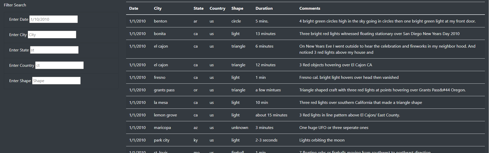
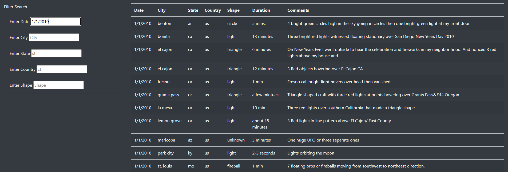
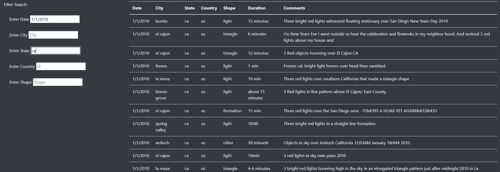
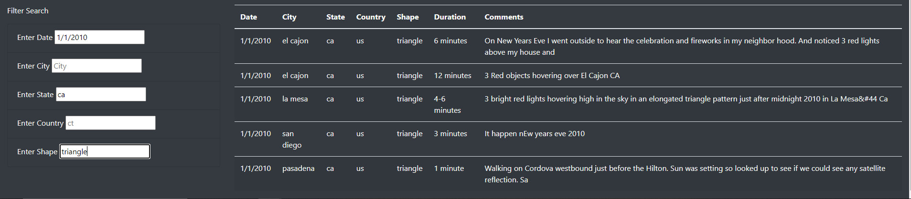

# UFO Sightings
## Project Overview
The purpose of this project is to create a web page that stores [data documenting UFO sightings](static/js/data.js) in a user-friendly manner. An [index.html file](index.html) was created to format the the web page, provide some backstory for the data being presented, and store the UFO data in a table. The index.html was styled with [CSS](static/css/style.css) to make it more visually appealing, and [javascript functionality](static/js/app.js) was added to allow users to filter the data table with a series of search bars.
## Results

When the web page is first loaded, the full table of data is shown and the "Filter Search" bars are empty. Each search bar shows a greyed example text that gives the user an idea of the format their inputs should be. 

### Using Filters

Once a filter term is typed into the search bar and the javascript code detects a change, either from hitting "enter" or clicking on another search bar, the table filters itself and reloads to only show rows that contain the filter term.

        

As more filters are added, the table becomes more restricted, showing only rows that contain all of the filter terms. The filter system operates like an AND statement, meaning all of the filter criteria must be read as True for a row to be displayed.
## Summary
One drawback of this filter design is that it is limited to one term per search box. This means that if someone was trying to look at data spanning a certaing time range, or looking for data from multiple neighboring cities, the current table setup would be unwieldy to use. I would recommend modifying the filters to accept multiple terms per search bar so that users have a higher degree of freedom in customizing their searches. Also, since the filter search bars are currently case- and format-specific, I would recommend modifying the javascript that reads the inputs to reformat incorrect inputs so that they will be detected by the filter. This would help curb user-error when using the filters. Another option would be to change the search bars to drop-down menues where users could check the items in each category that they would like to filter by.
